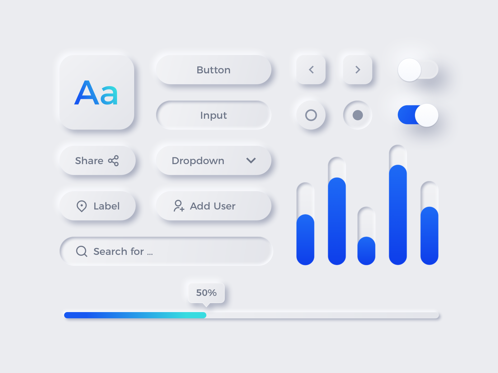

> ⭐ ***README** to coś więcej niż opis. Poprzez nie **pokazujesz swoje mocne strony** – swoją dokładność, sposób myślenia i podejście do rozwiązywania problemów. Niech Twoje README pokaże, że masz **świetne predyspozycje do rozwoju!***
> 
> 🎁 *Zacznij od razu. Skorzystaj z **[szablonu README i wskazówek](https://github.com/devmentor-pl/readme-template)**.* 

&nbsp;

# Neumorfizm

Neumorfizm to pewien trend w projektowaniu, który opiera się na odpowiednim wykorzystaniu cieni.

W tym projekcie Twoim zadaniem będzie utworzenie z pomocą Styled Components kilku komponentów zgodnych z tym trendem.

Formularz powinien być rozbudowany, lecz to od Ciebie zależy, jakie elementy w nim zawrzesz.

Zanim przejdziesz do implementowania, zapoznaj się z kilkoma artykułami na temat neumorfizmu:
- [Neumorphism in user interfaces](https://uxdesign.cc/neumorphism-in-user-interfaces-b47cef3bf3a6) (jeśli wykorzystałeś darmowy limit, to wystarczy otworzyć tę stronę w trybie incognito)
- [Neumorphism: why it’s all the hype in UI design](https://www.justinmind.com/blog/neumorphism-ui/)
- [Neumorphism. The Next Big Thing In UI Design?](https://opengeekslab.com/blog/neumorphism-the-next-big-thing-ui-design/)

## Komponenty

Gdy zdecydujesz, z czego ma się składać Twój formularz, stwórz odpowiednie komponenty: pola tekstowe, listy rozwijane, checkboxy, buttony, paski postępu itd. Możesz skorzystać z podpowiedzi z punktu poniżej (Formularz).

Po zapoznaniu się z podlinkowanymi artykułami wiesz już, na czym polega neumorfizm. Jeśli potrzebujesz dodatkowych wskazówek, to zachęcam Cię do skorzystania z [generatora kodu CSS](https://neumorphism.io/). Możesz również inspirować się [przykładami innych](https://bashooka.com/inspiration/neumorphism-ui-design-examples/).

Jeśli masz własną koncepcję komponentów, to nie widzę przeszkód, abyś z niej skorzystał. Jeśli nie, to możesz się wzorować na poniższej grafice od [Emy Lascan (MazePixel)](https://uibundle.com/products/428-freebie-neumorphic-ux-ui-elements).

## Formularz

Kiedy będziesz mieć gotowe komponenty, zacznij budować swój formularz.

Pamiętaj, aby w pełni prezentował on Twoje możliwości, np.:
- składał się z trzech etapów (kroków, ekranów), po których można wygodnie się przemieszczać
- posiadał rozwijaną listę implementowaną przez specjalne rozwiązanie, inne niż `select`
- miał animowane elementy typu `chceckbox` czy `radio`
- poziom wypełnienia pól prezentował przez pasek postępu
- informował użytkownika od razu po wprowadzeniu błędnych danych.

Jestem pewny, że ten projekt mocno zainteresuje Twojego przyszłego pracodawcę!

PS Konfigurację środowiska zrób według własnego uznania.

&nbsp;

> ⭐ ***README** to coś więcej niż opis. Poprzez nie **pokazujesz swoje mocne strony** – swoją dokładność, sposób myślenia i podejście do rozwiązywania problemów. Niech Twoje README pokaże, że masz **świetne predyspozycje do rozwoju!***
> 
> 🎁 *Zacznij od razu. Skorzystaj z **[szablonu README i wskazówek](https://github.com/devmentor-pl/readme-template)**.* 